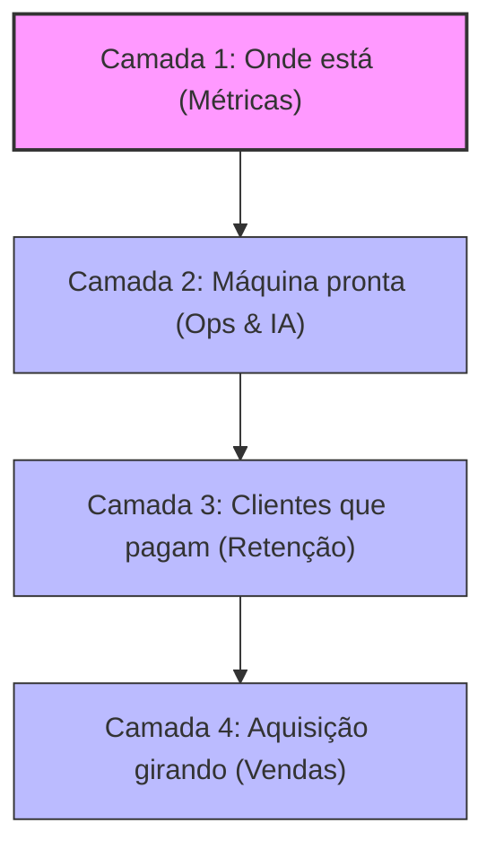
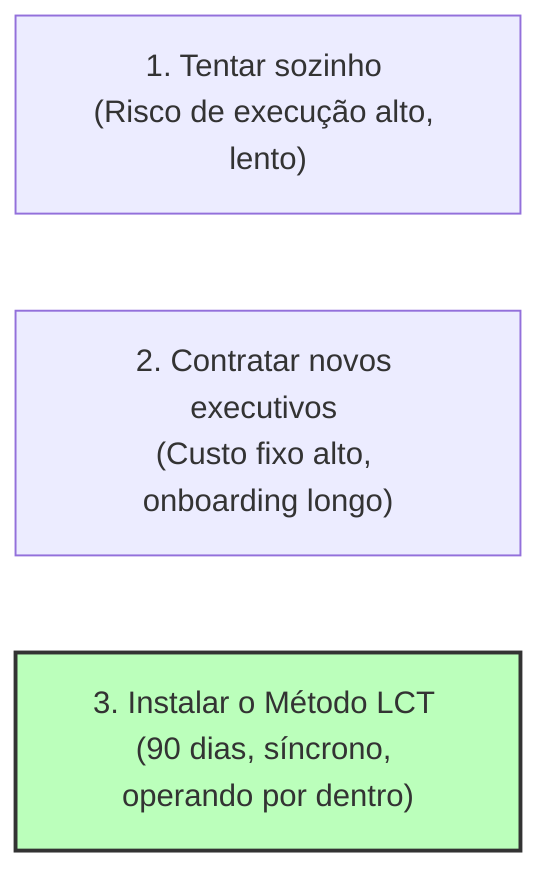

# Template: Relatório Executivo Raio-X LCT
*Versão 2.0.0 | Autor: LCT Consulting (Leandro Tavares)*

> **Propósito do Documento:** Este é o esqueleto do entregável físico do **Degrau 1 (Sessão Estratégica Executiva)**. Ele deve ser personalizado após a Reunião Estratégica (Elo 5) com os dados reais do cliente. A redação deve seguir à risca o tom de voz da LCT (skill `brand-lct`): analítico, cirúrgico, sem floreios corporativos e focado em redefinir o problema do cliente do "preciso vender" para o "minha arquitetura está quebrada".

> **Propósito do Documento:** Este é o esqueleto do entregável físico do **Degrau 1 (Sessão Estratégica Executiva)**. Ele deve ser personalizado após a Reunião Estratégica (Elo 5) com os dados reais do cliente. A redação deve seguir à risca o tom de voz da LCT: analítico, cirúrgico, sem floreios corporativos e focado em redefinir o problema do cliente do "preciso vender" para o "minha arquitetura está quebrada".

---

## 📄 CAPA: Relatório de Diagnóstico de Arquitetura de Crescimento
**Preparado exclusivamente para:** [Nome do CEO], CEO da [Nome da Empresa]  
**Data:** [Data de Emissão]  
**Responsável:** Leandro Tavares, Arquiteto de Crescimento  

---

## PÁGINA 1: O Veredito (Resumo Executivo)

### 1.1 O Diagnóstico em uma Frase-Soco
> *"[Inserir frase curta e brutal que resuma a raiz do problema. Exemplo: 'A Youcast não tem um problema de leads; ela tem uma operação de atendimento que consome 35% do faturamento, travando a margem operacional e gerando churn silencioso que anula o esforço de vendas.']"*

### 1.2 O Teto Declarado vs. O Gargalo Real
O empresário de tecnologia frequentemente confunde o sintoma com a causa. Abaixo está a tradução técnica do estado atual da [Nome da Empresa]:

| Sintoma Declarado (A ilusão comercial) | Causa Sistêmica (A realidade estrutural) |
| :--- | :--- |
| "Meu time comercial é fraco e não bate as metas." | O time está desperdiçando 60% do tempo qualificando leads fora do ICP real para compensar o churn estrutural. |
| "A concorrência está prostituindo o preço no mercado." | Falta de diferenciação de infraestrutura e sobrecarga do time técnico, forçando a venda pela urgência/preço. |
| "Preciso de mais leads no topo do funil." | Injetar água em um cano furado. A máquina de onboarding atual destrói o LTV nas primeiras 12 semanas. |

---

## PÁGINAS 2-3: Raio-X das 4 Camadas (A Anatomia do Sistema)

Abaixo está o mapa das quatro camadas da [Nome da Empresa], analisadas na sequência inversa.

### Camada 1: Onde você realmente está (Métricas & EBITDA)
*   **Status de Profundidade:** Média (M)
*   **A Realidade Crua:** 
    *   O EBITDA real após expurgar custos não operacionais e pro-labore artificial está em **[X]%**.
    *   O NRR (Net Revenue Retention) atual é de **[Y]%**, o que significa que o seu crescimento é caro porque você precisa repor receita perdida constantemente.
    *   **O Teto Operacional:** Com o atual modelo de custos e entrega manual, a margem de contribuição de novos clientes tende a cair à medida que a empresa escala.

### Camada 2: A máquina pronta (Governança, Processos & IA)
*   **Status de Profundidade:** Baixa (B)
*   **A Realidade Crua:**
    *   A operação é centralizada no CEO e em decisões de corredor.
    *   **Gargalo de Pessoas:** Há excesso de intermediários operacionais caros executando tarefas repetitivas (ex.: digitação de propostas, envio de cobranças, triagem de suporte básico) que poderiam ser automatizadas por **agentes de IA**.
    *   Falta de um dashboard de comando que ligue a saúde técnica à saúde financeira sem "tradução" humana.

### Camada 3: Os clientes que já pagam (Sucesso & Retenção)
*   **Status de Profundidade:** Baixa (B)
*   **A Realidade Crua:**
    *   O Churn da base de clientes nos últimos 12 meses está acumulado em **[Z]%**.
    *   A implantação ou ativação (onboarding) é artesanal e depende da boa vontade de analistas específicos, gerando inconsistência na entrega de valor inicial.
    *   Não há playbooks de expansão (Upsell) na base; a receita cresce apenas por novos contratos.

### Camada 4: A aquisição girando (Comercial & Marketing)
*   **Status de Profundidade:** Baixa (B)
*   **A Reality Crua:**
    *   O comercial opera in modo de "tirador de pedido" ou fazendo prospecção outbound manual e ineficiente.
    *   O pipeline está inflado com leads desqualificados, gerando falsas métricas de engajamento no CRM e exaustão dos vendedores.

---

## PÁGINAS 4-5: A Matemática do Teto (A Prova Numérica)

> **"Opiniões não quebram tetos. Números sim."**

A tabela abaixo simula o vazamento de caixa (Revenue Leakage) causado pelo atual desenho da sua empresa nos próximos 12 meses, se nenhuma cirurgia de infraestrutura for realizada.

### Tabela: O Custo da Inércia (Simulação Financeira)

| Métrica Analisada | Cenário Atual (Inércia) | Impacto com Desenho LCT | Dinâmica do Impacto |
| :--- | :--- | :--- | :--- |
| **NRR (Retenção Líquida)** | [Ex: 92%] | **[Ex: 110%]** | Mais receita sem gastar R$ 1 de CAC. |
| **Custo Operacional de Ops**| [Ex: R$ 80k/mês] | **[Ex: R$ 50k/mês]** | Substituição de tarefas repetitivas por IA. |
| **Múltiplo de M&A (EBITDA)**| [Ex: 3.5x] | **[Ex: 6.0x]** | Aumento da atratividade institucional da empresa. |
| **Vazamento Anual Estimado**| **R$ [Inserir Valor]**| **R$ 0,00** | **Dinheiro deixado na mesa por problemas de arquitetura.** |

### O Diagnóstico da Linha de Fuga
O vazamento financeiro não está na falta de capacidade de fechar novos negócios, mas na **taxa de dissipação interna** (churn oculto, processos ineficientes e ineficiência de custos de entrega). Cada real novo adicionado no comercial sofre um desconto de **[X]%** devido aos atritos de infraestrutura.

---

## PÁGINAS 6-7: Recomendações de Arquitetura (A Inversão)

Para romper o teto e preparar a empresa para o crescimento previsível ou uma futura venda (M&A), a LCT recomenda despriorizar ações de aquisição imediata e focar nas seguintes ações estruturais nos próximos 90 dias:

### Ação 1: Refatoração das Métricas Chave (Camada 1)
- Instalação imediata do dashboard financeiro direto (EBITDA real por produto/cliente).
- Expurgar clientes "tóxicos" de margem negativa que drenam o time técnico.

### Ação 2: Blindagem da Base Existente (Camada 3)
- Padronizar o processo de onboarding de novos clientes nas primeiras 4 semanas para reduzir o churn precoce.
- Automatizar gatilhos de expansão (Upsell) na base baseados em maturidade de uso.

### Ação 3: Automação e Substituição por IA (Camada 2)
- Mapeamento das 3 tarefas operacionais que mais consomem tempo da equipe de suporte/atendimento.
- Substituição dessas camadas por agentes de IA inteligentes que operam 24/7.

---

## PÁGINAS 8-9: A Resolução — Quem e Como

O diagnóstico está claro. Agora resta responder à única pergunta que realmente importa para a continuidade do negócio:

> **Quem vai resolver isso e como?**

Existem três caminhos possíveis após este Raio-X:

### Como a LCT Resolve por Dentro
Nós não somos consultoria de PowerPoint. Se decidirmos seguir juntos, nós entraremos na sua operação para instalar o **Motor LCT** através da seguinte proposta:

#### O Próximo Degrau Recomendado: [Degrau 2 - Mentoria CEO / Degrau 3 - Diagnóstico / Degrau 4 - Consultoria Full]

*   **O que faremos:** [Descrever de forma direta a intervenção sugerida, ex.: "Instalação da Máquina Operacional Mowia de IA e Refatoração de CS durante 90 dias"].
*   **Qual o prazo:** [Ex: 90 dias cravados].
*   **Qual a presença:** Leandro Tavares operando semanalmente ao lado do CEO e do comitê executivo.
*   **Garantia de Entrega:** Código rodando, agentes de IA implantados e ponteiros de margem movimentados.

*A sua empresa não precisa de mais vendas hoje. Ela precisa de arquitetura para suportar o amanhã. Nós temos a cicatriz, a tecnologia e o método para instalar essa arquitetura.*

---
**Declaração de Encerramento:**  
Este diagnóstico reflete a verdade nua obtida nas análises de dados e na Reunião Estratégica. O improviso é um amadorismo caro. O método é a única saída.
[Assinatura de Leandro Tavares]
